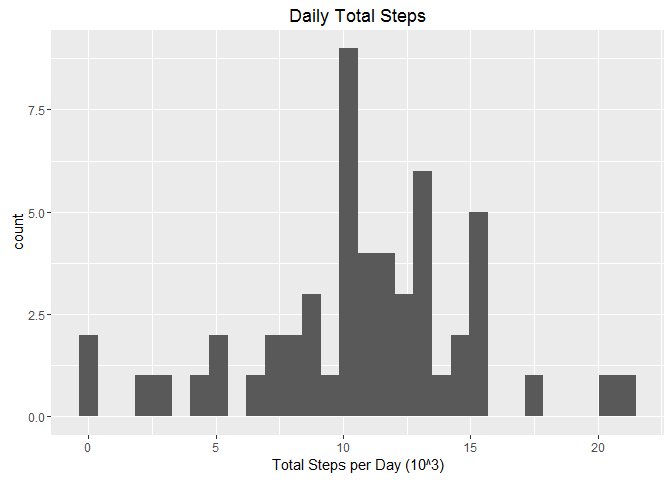
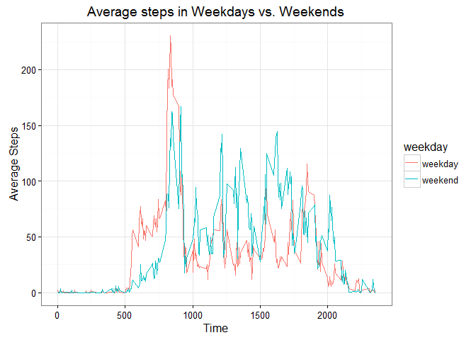

# Reproducible Research: Peer Assessment 1
Xiaoan Xie  
October 25, 2016  


## Loading and preprocessing the data
Download the zip file, unzip it and read into R

```
## [1] "C:/Users/302016380/Desktop/Data Science/5. Reproducible data analysis/wk2 project"
```

## What is mean total number of steps taken per day?
Calculate totle steps each day and store them in table "steps_per_dat_raw", here "raw" indicates that missing values are kept.

```r
steps_per_day_raw <- as.data.frame.table(tapply(activity$steps, 
                                                  activity$date, sum, na.rm=FALSE))
names(steps_per_day_raw)<-c("date", "total_steps")
```

Plot histogram plot of daily total steps

```r
library("ggplot2")
qplot(total_steps/1000, data=steps_per_day_raw, xlab="Total Steps per Day (10^3)", main = "Daily Total Steps")
```

```
## `stat_bin()` using `bins = 30`. Pick better value with `binwidth`.
```

```
## Warning: Removed 8 rows containing non-finite values (stat_bin).
```

<!-- -->

Calculate mean and median steps per day excluding NA.

```r
mean_step_per_day_raw<-mean(steps_per_day_raw$total_steps, na.rm = TRUE)
median_step_per_day_raw<-median(steps_per_day_raw$total_steps, na.rm = TRUE)
```
#### The average daily total steps is 1.0766189\times 10^{4}, the median daily total steps is 10765

## What is the average daily activity pattern?
Calculate average steps in each 5 minutes interval 

```r
steps_mean_5.min_raw <- as.data.frame.table(
    tapply(activity$steps, activity$interval, mean, na.rm = TRUE))
names(steps_mean_5.min_raw)<-c("time", "average_steps")
```

Plot to illustrate daily activity pattern

```r
library("ggplot2")
g<-ggplot(steps_mean_5.min_raw, aes(time, average_steps))
g+geom_point()+
    labs(x="Time")+
    labs(y="Average Steps")+
    labs(title="Average Steps in 5 min Interval Across All Day")+
    scale_x_discrete(breaks=c(0000, 0200, 0400, 0600, 0800, 1000, 1200,
                              1400, 1600, 1800, 2000, 2200, 2355))
```

<!-- -->
                                                                
Find maxium average steps across all day in each 5 minutes intervlas and report the time of it

```r
max<-max(steps_mean_5.min_raw$average_steps)
max_step_5.min_index_raw<-(grep(max(steps_mean_5.min_raw$average_steps), steps_mean_5.min_raw$average_steps))
max_time_raw<-steps_mean_5.min_raw[max_step_5.min_index_raw,1]
```

#### The maxium average steps across all day is 206.1698113 at time 835

## Imputing missing values
Calculate total missing value in the data set

```r
total_NA<-sum(is.na(activity))

print(colSums(is.na(activity)), type="html")
```

```
##    steps     date interval 
##     2304        0        0
```
#### There are 2304 missing value in the data set in column "Steps"

Replace NA with the average steps in that time interval which are stored in "steps_mean_5.min_raw" dataset calculated previously

```r
activity_rmNA<-activity

activity_rmNA[is.na(activity_rmNA$steps), "steps"]<-
    steps_mean_5.min_raw[, "average_steps"]
## this code is amazing! it has the same result from codes below
# merge<-merge(activity_rmNA, steps_mean_5.min_raw, by.x="interval", by.y = "time")
# merge[is.na(merge$steps), "steps"]<-merge[is.na(merge$steps), "average_steps"]
# merge<-arrange(merge, date)
# merge<-merge[,1:3]
```

Calculate total steps per day after imputing NA

```r
steps_per_day_rmNA <- as.data.frame.table(tapply(activity_rmNA$steps, 
                                                activity_rmNA$date, sum))
names(steps_per_day_rmNA)<-c("date", "total_steps")
```

Calculate mean and median after imputing NA and repost

```r
mean_step_per_day_rmNA<-mean(steps_per_day_rmNA$total_steps)
median_step_per_day_rmNA<-median(steps_per_day_rmNA$total_steps)
```

#### The average daily steps after imputing NA is 1.0766189\times 10^{4}, while the median of them is 1.0766189\times 10^{4}

Plot histogram chart of both data with or without NA to compare the impact of imputing NA

```r
g1<-qplot(total_steps/1000, data=steps_per_day_raw, 
          xlab=NULL, main="Total Steps per Day with NA")

g2<-qplot(total_steps/1000, data=steps_per_day_rmNA, 
          xlab="Total Steps per Day (10^3)", main = "Total Steps per Day with Imputed NA")

library("Rmisc")
```

```
## Loading required package: lattice
```

```
## Loading required package: plyr
```

```r
multiplot(g1, g2)
```

```
## `stat_bin()` using `bins = 30`. Pick better value with `binwidth`.
```

```
## Warning: Removed 8 rows containing non-finite values (stat_bin).
```

```
## `stat_bin()` using `bins = 30`. Pick better value with `binwidth`.
```

<!-- -->

```r
# this function requires Rmisc package
```

#### Imputing NA by replacing them with the average steps in that time interval doesn't change the results much

## Are there differences in activity patterns between weekdays and weekends?

Create column to indicate whether that day is weekday or weekend.

```r
library("dplyr")
```

```
## 
## Attaching package: 'dplyr'
```

```
## The following objects are masked from 'package:plyr':
## 
##     arrange, count, desc, failwith, id, mutate, rename, summarise,
##     summarize
```

```
## The following objects are masked from 'package:stats':
## 
##     filter, lag
```

```
## The following objects are masked from 'package:base':
## 
##     intersect, setdiff, setequal, union
```

```r
activity_rmNA$date<-as.Date(activity_rmNA$date)
activity_rmNA_WD<-mutate(activity_rmNA, 
                         weekdays=weekdays(activity_rmNA$date))
# above code generate detailed weekdays ("monday"...)
activity_rmNA_WD<-mutate(activity_rmNA_WD, 
                         weekday=ifelse(
                             activity_rmNA_WD$weekdays=="Saturday"|
                                 activity_rmNA_WD$weekdays=="Sunday",
                             "weekend", "weekday"))
activity_rmNA_WD$weekdays<-NULL
# combine weekdays into "Weekday" and "Weekend"
```

Calculate mean in each interval/weekday

```r
WDdata<-aggregate(activity_rmNA_WD$steps, by = list(activity_rmNA_WD$interval,
                                                  activity_rmNA_WD$weekday), 
                mean)
names(WDdata)<-c("interval", "weekday", "average_steps")
```

Plot to compare weekdays vs. weekends

```r
g3<-ggplot(WDdata, aes(interval, average_steps))
g3+geom_line(aes(color=weekday))+
    labs(x="Time")+
    labs(y="Average Steps")+
    labs(title="Average steps in Weekdays vs. Weekends")+
    theme_bw()
```

<!-- -->

#### Activity in weekends are lighter in the morning comaring with weekdays, and heavier in the day time, indicating a different lifing/working style in weekends
I didn't use panel plot here coz I want to show a direct comparison


